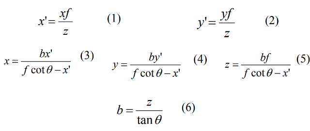
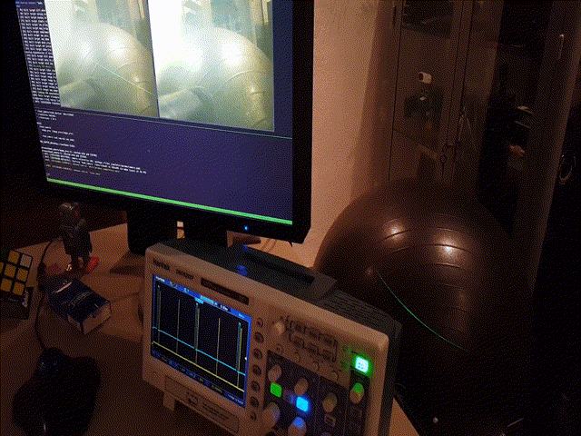
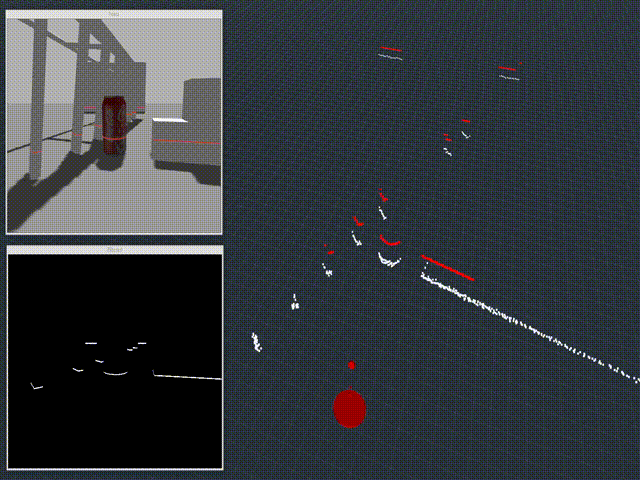
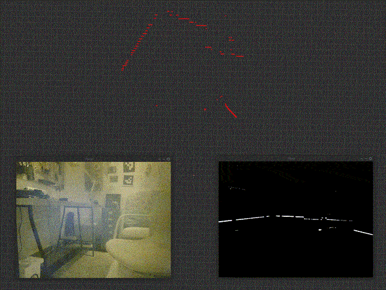

# ros_webcam_lidar
##### Webcam and laser line generator based low cost LiDAR for ROS

##### Concept
Concept of operation is simply a pixel-wise triangulation of all laser line points reflected from the object to the imaging surface of the camera. In order to calculate the physical distance of such a point the size of the imaging surface (CCD), focal length of the lens (f), the distance between the laser projector and camera (b) and the angle between the imaging surface and the line generator (theta) must be known:


Then we can use simple trigonometric functions on the pixel coordinates to estimate the distance of each point (x,y,z).



##### Filtering
In order to cancel out all the irrelevant pixels that does not belong to the reflected laser light this package supports two methods:
* One could use a narrow-band-pass optical filter and physically block out a part of the spectrum. _(Potentially old flat-bed scanners might contain such filters.)_
* Or we can modulate the laser illumination by synchronizing to camera frames. *(strobed mode)*
* Essentially these two methods could be combined to achieve a superior filtering effect.


*Normal mode*

The **soft_color_filter** node subscribes to a raw image topic, converts the image to HSV format and applies openCV's range color filter that can be adjusted through dynamic reconfiguration parameters. The published image is binary thresholded so that the *triangulation_node* receives only the relevant pixels. This pathway is marked with blue on the above diagram.

```xml
<node pkg="webcam_lidar" type="soft_color_filter" name="color_filter_node">
  <rosparam file="$(find webcam_lidar)/params/color_filter.yaml"/>
  <param name="camera_topic" value="/head_camera/image_raw"/> <!-- raw camera image -->
  <param name="headless" value="false"/> <!-- display raw feed and color filtered video windows -->
  <param name="strobed_mode" value="false"/> <!-- use only if every second frame is illuminated -->
</node>
```

*Strobed mode*

In this mode the *soft_color_filter* expects alternating images of one laser illuminated frame followed by another without laser light. HSV range filter is then applied to both frames and their absolute difference is rendered to the output.

There are several ways to create such a setup _(e.g. global shutter camera with frame sync. output would be preferred)_, but the most cost effective is probably using the [VSYNC output](http://nuigroup.com/forums/viewthread/12445) of the popular Sony PS3 Eye web camera as trigger:


There is an attached example [firmware](firmware/ps_eye_sync.cpp) for Arduino on how to control the laser to make sure that one frame receives no laser light and the other is illuminated. _Take a closer look on the oscilloscope below (and ignore it on the above picture), the laser is turned on only for a short period of time and slightly before the camera reports frame ready:_



##### Filtered image to pointcloud
The output of the *soft_color_filter* is processed by the **webcam_lidar** node.

```xml
cam_laser_distance:     0.2       # meters
cam_laser_angle:        1.42      # radians
cam_focal_length:       0.0001    # meters
ccd_vertical_measure:   0.000119  # physical size of the CCD in meters
ccd_horizontal_measure: 0.00015   # meters
pixel_threshold:        0         # luminosity threshold for postfiltering
```




